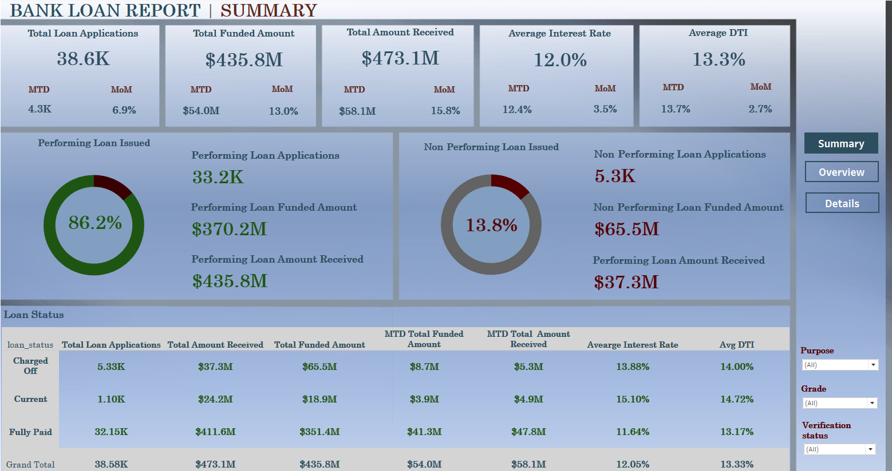
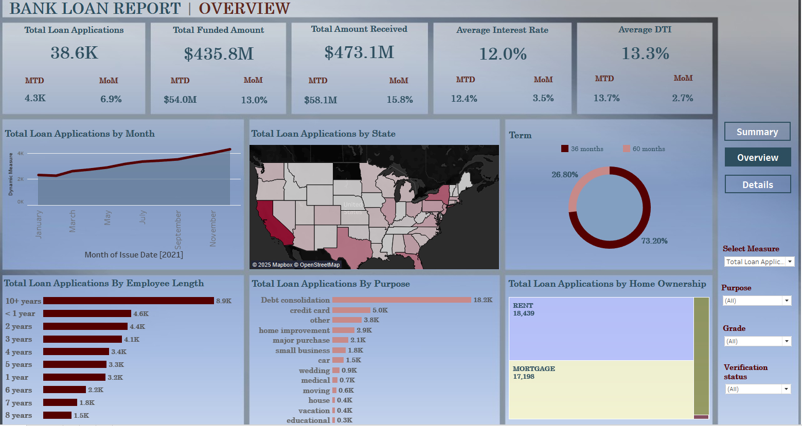
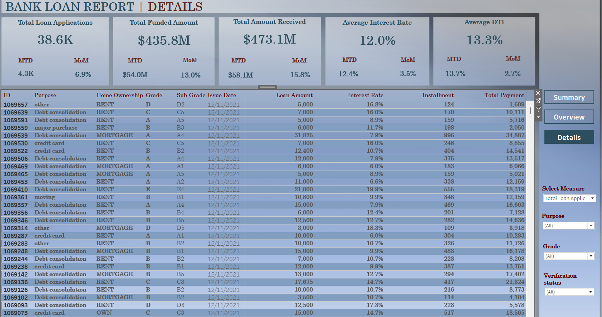

# **Bank Loan Analytics Dashboard**
> Analysis of loan applications and repayment performance using SQL for data preparation and Tableau for interactive dashboards.

## 📋 Table of Contents
- [📚 Project Overview](#📚-project-overview)
- [📊 Dataset Description](#📊-dataset-description) & [💻 Tools and Technologies](#💻-tools-and-technologies)
- [📈 Key Dashboards](#📈-key-dashboards)
  - [🔹 1. Loan Performance Summary](#🔹-1-loan-performance-summary)
  - [🔹 2. Loan Trends Overview](#🔹-2-loan-trends-overview)
  - [🔹 3. Loan Details and Risk Analysis](#🔹-3-loan-details-and-risk-analysis)
- [🖋️ Queries and Analysis](#🖋️-queries-and-analysis)
- [💡 Key Insights](#💡-key-insights)
---

## **📚 Project Overview**
This project analyzes bank loan data to uncover key lending trends, borrower characteristics, and loan performance metrics. Using **SQL**, **Python**, and **Tableau**, I built interactive dashboards to provide decision-makers with actionable insights into loan applications, funding, and repayment.

The project focuses on answering business questions like:
- What are the key factors affecting loan performance?
- How do loan purposes and regional variations impact funding and repayments?
- What borrower profiles are more likely to receive larger loans?

---

## **📊 Dataset Description**
The dataset includes **38,000 loan records** with the following key features:
- **Loan Status:** Fully Paid, Charged Off, Current
- **Loan Amounts:** Amount funded, amount received, and outstanding balance
- **Borrower Information:** Employment length, homeownership, and annual income
- **Credit and Risk Metrics:** Debt-to-Income ratio (DTI), loan grade, and interest rates
- **Loan Dates:** Issue date, term length

---

## **💻 Tools and Technologies**
- **SQL:** Data extraction, cleaning, and preprocessing  
- **Tableau Desktop:** Dashboard creation and visualization   
- **Jupyter Notebook:** Supporting queries and Python analysis (if applicable)  

---

## **📈 Key Dashboards**
This project includes **three interactive dashboards**, each providing valuable insights:

### 🔹 **1. Loan Performance Summary**
- **Purpose:** Provides an overview of key performance indicators, including loan applications, funded amounts, and payment collections.
- **Interactivity:** Filters for loan purpose, grade, and verification status.
- **Visuals:** Donut charts for performing and non-performing loans, loan status summary, and monthly performance comparisons.
- **Tableau Dashboards:** Published on **Tableau Public**  - [Bank Loan Report | SUMMARY](https://public.tableau.com/app/profile/kateryna.zahrebina/viz/BankLoanReport_17387175778250/Summary)



### 🔹 **2. Loan Trends Overview**
 - **Purpose:** Examines monthly trends, regional performance, loan term preferences, and borrower characteristics.
- **Interactivity:** Dynamic measure selector for total loan applications, funded amounts, and received payments.
- **Visuals:** Line charts for monthly trends, state-level maps, and breakdowns by employee length, loan purpose, and homeownership status.
- **Tableau Dashboards:** Published on **Tableau Public**  - [Bank Loan Report | OVERVIEW](https://public.tableau.com/app/profile/kateryna.zahrebina/viz/BankLoanReport_17387175778250/Summary) **Navigate to Overview dashboard** using the built-in navigation buttons.



### 🔹 **3. Loan Details and Risk Analysis**
- **Purpose:** Deep dive into specific loan statuses, borrower characteristics, and performance at a granular level.
- **Interactivity:** Filters for individual records and comparative measures across dimensions.
- **Tableau Dashboards:** Published on **Tableau Public**  - [Bank Loan Report | DETAILS](https://public.tableau.com/app/profile/kateryna.zahrebina/viz/BankLoanReport_17387175778250/Summary), **Navigate to Details dashboard** using the built-in navigation buttons


---

# **🖋️ Queries and Analysis**
## **📊 SUMMARY DASHBOARD Analysis and Insights**

### ** Relationship Between Loan Performance and Borrower Behavior**
- The segmentation of loans into **Performing Loans** (86.2%) and **Non-Performing Loans** (13.8%) shows that the majority of borrowers are meeting their financial obligations
- A closer look at **non-performing loans** reveals they are often associated with slightly higher **interest rates (13.88%)**, suggesting that loans priced for higher credit risk tend to experience more defaults
  
  ✨**Key Insight:** Loans with higher interest rates, while offering higher potential returns, also correlate with higher default rates. Balancing risk and return through stricter risk assessment can help improve long-term profitability. 

**Query: Performing Loan Percentage**
```sql
SELECT 
    ROUND(
        (COUNT(CASE WHEN loan_status = 'Fully Paid' OR loan_status = 'Current' 
             THEN id END) * 100.0) / COUNT(id), 2
    ) AS Good_loan_percentage
FROM fin_loan;
```

### ** Month-to-Date (MTD) Trends Indicate Active Loan Growth and Repayment Efficiency**
- MTD loan applications (**4.3K**) and funded amounts (**$54M**) reflect a strong ongoing lending activity, supported by a **month-over-month growth of 13%** in loan issuance.
- Similarly, **MTD repayments of $58.1M**, representing a **15.8% month-over-month growth**, show that recent borrowers are actively repaying their loans.
  
  ✨**Key Insight:** Faster growth in repayments compared to loan issuance suggests that the bank’s collection strategies are effective, and cash flow stability is being maintained. Monitoring MTD metrics allows for early detection of repayment slowdowns.

**Query: MTD Total Loan Applications & MTD Total Funded Amount**
```sql
SELECT COUNT(id) AS MTD_Total_Applications
FROM fin_loan
WHERE MONTH(issue_date) = 12 AND YEAR(issue_date) = 2021;

SELECT SUM(loan_amount) AS MTD_Total_Funded_Amount
FROM fin_loan
WHERE MONTH(issue_date) = 12 AND YEAR(issue_date) = 2021;
```

### **Role of Debt-to-Income Ratio (DTI) in Identifying Risk**
- The **average DTI of 13.3%** across all loans is generally within acceptable limits. However, non-performing loans display a slightly elevated DTI, indicating that borrowers with higher debt obligations relative to their income face more challenges in meeting repayment schedules.
  
  ✨**Key Insight:** Borrowers with higher DTI ratios are more vulnerable to default, particularly in economic downturns. Incorporating stricter DTI limits during loan approval could reduce future defaults.

**Query: Loan Status Grid View**
```sql
SELECT 
    loan_status,
    COUNT(id) AS Loan_Count,
    SUM(total_payment) AS Total_amount_Received,
    SUM(loan_amount) AS Total_amount_Funded,
    ROUND(AVG(int_rate) * 100, 4) AS Interest_rate,
    ROUND(AVG(dti) * 100, 4) AS DTI
FROM fin_loan
GROUP BY loan_status;
```
# **📊 OVERVIEW DASHBOARD Analysis and Insights**

### **Key Metrics:**
- **Total Loan Applications:** 38.6K  
- **Total Funded Amount:** $435.8M  
- **Total Amount Received:** $473.1M  

---

### **Total Loan Applications by Month**
✨**Key Insight:** The consistent rise in applications indicates a strong demand for credit, with late-year peaks potentially driven by spending spikes. Companies may want to adjust marketing efforts and loan approvals during this period to optimize revenue.

**Query: Key Monthly Trends**
 ```sql
  SELECT 
    MONTH(issue_date) AS Month_number, 
    MONTHNAME(issue_date) AS Month_name, 
    COUNT(id) AS Total_loan_applications, 
    SUM(loan_amount) AS Total_funded_amount, 
    SUM(total_payment) AS Total_received_amount 
  FROM fin_loan 
  GROUP BY Month_number, Month_name 
  ORDER BY Month_number DESC;
  ```
---
### **Loan Applications by State**
- States with larger populations, such as **California** and **Texas**, show the highest concentration of loan applications and funded amounts.  
- However, some states in the Midwest and South exhibit medium-to-high activity, suggesting potential regional demand for specific loan products.

✨**Key Insight:** Loan distribution is not solely population-driven. Some less-populated states also show moderate activity, potentially due to economic factors or targeted marketing efforts. Banks can benefit from tailored strategies focusing on regions with rising demand

---

### **Loan Applications by Employee Length**
✨**Key Insight:** This distribution suggests that individuals with longer employment are seen as less risky by lenders, hence the higher loan approval rates. However, the considerable volume of loans for those with minimal experience suggests that banks are willing to support early-career professionals, possibly with higher interest rates.

**Query: Employee Length Analysis**
 ```sql
SELECT 
  emp_length, 
  COUNT(id) AS Total_loan_applications, 
  SUM(loan_amount) AS Total_funded_amount, 
  SUM(total_payment) AS Total_received_amount 
FROM fin_loan 
GROUP BY emp_length 
ORDER BY Total_funded_amount DESC;
 ```
### **Loan Applications by Purpose**
✨**Key Insight:** The focus on debt consolidation highlights the widespread issue of credit card and personal debt among borrowers. Banks could benefit by offering customized debt relief products and financial advisory services to improve repayment rates.

---

### **📈 Loan Terms: 36 Months vs. 60 Months**
✨**Key Insight:** The high preference for 60-month loans shows that many borrowers prioritize manageable monthly payments over reducing total interest. Adjusting interest rate structures to incentivize shorter loan terms could improve long-term revenue and reduce credit risk.


## **💡 Key Insights**
This section contains data-driven insights uncovered during the analysis, including patterns in loan performance, borrower profiles, and opportunities for business optimization.

1. **Loan Demand Surged Toward Year-End:**  
   - Loan applications peaked in December, highlighting potential seasonal borrowing spikes.

2. **Debt Consolidation is the Leading Purpose:**  
   - With over 18.2K applications, borrowers are focused on restructuring their finances.

3. **Regional Variations Suggest Expansion Opportunities:**  
   - States like California and Texas dominate the loan market, but others show growth potential.

4. **Longer Loan Terms Are Preferred:**  
   - Over 62% of funded loans have 60-month terms, suggesting borrowers prefer extended repayment.
